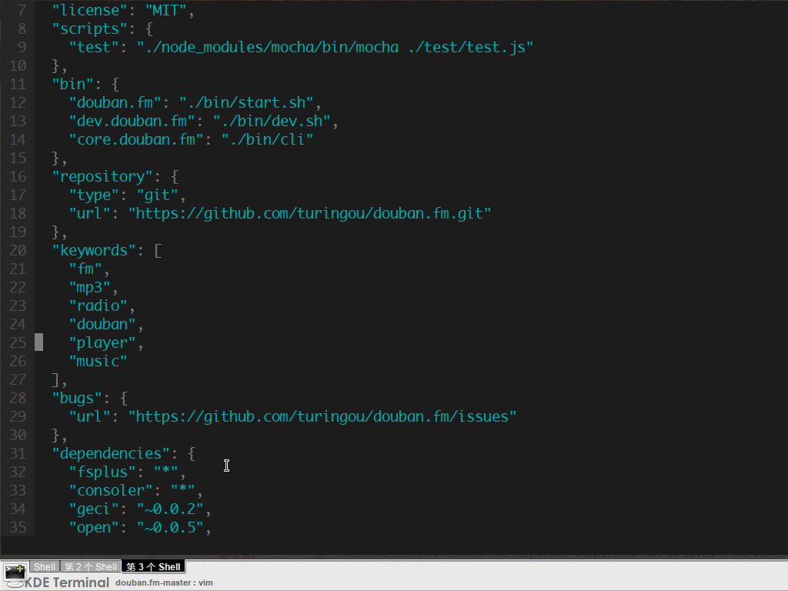

node-etymologycli 
---

**A command line tool of http://www.etymonline.com/**

> To explain what our words meant and how they sounded 600 or 2,000 years ago.

##install##

```npm install etymology-cli -g```

如果你是**Arch Linux**用户

```yaourt -S nodejs-etymologycli```

##Usage

```etym words```


